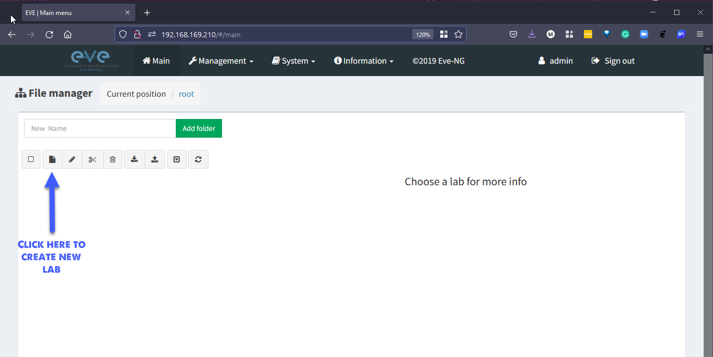
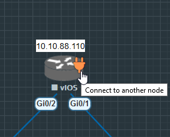

## Construyendo nuestro Laboratorio

Vamos a continuar con la configuración de nuestra red emulada utilizando EVE-NG y luego esperamos tener algunos dispositivos desplegados y empezar a pensar en cómo podemos automatizar la configuración de estos dispositivos. En el [Día 25](day25.md) vimos la instalación de EVE-NG en nuestra máquina utilizando VMware Workstation.

### Instalación del cliente de EVE-NG

También hay un paquete de cliente que nos permite elegir qué aplicación se utiliza en la conexiones SSH a los dispositivos. También configurará Wireshark para capturas de paquetes entre enlaces. Puedes hacerte con el pack de cliente para tu SO (Windows, macOS, Linux).

[Descarga del cliente EVE-NG](https://www.eve-ng.net/index.php/download/)

Sugerencia rápida: Si utilizas Linux como cliente, existe este [paquete de cliente](https://github.com/SmartFinn/eve-ng-integration).

La instalación es directa y como sugerencia, en un principio, es mejor dejar los valores predeterminados.

### Obtención de imágenes de red

Este paso ha sido todo un reto, he seguido algunos videos que están enlazados al final en el apartado de recursos y descargas para las imágenes de nuestro router y switch a la vez que nos indican cómo y dónde subirlas.

Es importante tener en cuenta que yo uso todo con fines educativos. Yo sugeriría descargar imágenes oficiales de los proveedores de red.

[Blog y enlaces a vídeos de YouTube](https://loopedback.com/2019/11/15/setting-up-eve-ng-for-ccna-ccnp-ccie-level-studies-includes-multiple-vendor-node-support-an-absolutely-amazing-study-tool-to-check-out-asap/)

[Cómo añadir la imagen Cisco VIRL vIOS a Eve-ng](https://networkhunt.com/how-to-add-cisco-virl-vios-image-to-eve-ng/)

En general, los pasos aquí son un poco complicados y podrían ser mucho más fáciles, pero los blogs y videos anteriores guían a través del proceso de añadir las imágenes a su caja EVE-NG.

Se ha utilizado FileZilla para transferir el qcow2 a la máquina virtual a través de SFTP.

Para nuestro laboratorio, necesitamos Cisco vIOS L2 (switches) y Cisco vIOS (router)

### Crear un Laboratorio

Dentro de la interfaz web de EVE-NG, vamos a crear nuestra nueva topología de red. Tendremos cuatro switches y un router que actuará como nuestra puerta de enlace a redes externas.

| Node    | IP Address   |
| ------- | ------------ |
| Router  | 10.10.88.110 |
| Switch1 | 10.10.88.111 |
| Switch2 | 10.10.88.112 |
| Switch3 | 10.10.88.113 |
| Switch4 | 10.10.88.114 |

#### Añadir nodos a EVE-NG

La primera vez que inicies sesión en EVE-NG verás una pantalla como la siguiente, queremos empezar por crear nuestro primer laboratorio.

Dale un nombre a tu laboratorio y los otros campos son opcionales.

Te aparecerá un lienzo en blanco para crear tu red. Haz clic con el botón derecho del ratón sobre el lienzo y selecciona añadir nodo.

A partir de aquí tendrás una larga lista de opciones de nodos, si has seguido lo anterior tendrás los dos en azul que se muestran a continuación y los otros van a ser de color gris y no seleccionables.

Queremos añadir lo siguiente a nuestro laboratorio:

- 1 x Cisco vIOS Router
- 4 x Cisco vIOS Switch

Ejecuta el sencillo asistente para añadirlos a tu laboratorio y deberías tener este aspecto.

#### Conectando nuestros nodos

Ahora necesitamos añadir nuestra conectividad entre nuestros routers y switches. Podemos hacerlo fácilmente pasando el ratón por encima del dispositivo y viendo el icono de conexión como se muestra a continuación y conectándolo al dispositivo al que deseamos conectarnos.

Cuando hayas terminado de conectar tu entorno, es posible que también desees añadir alguna forma de definir los límites físicos o ubicaciones utilizando cajas o círculos que también se pueden encontrar en el menú del botón derecho. También puedes añadir texto, lo cual es útil cuando queremos definir nuestros nombres o direcciones IP en nuestros laboratorios.

Seguí adelante e hice mi laboratorio como el siguiente.

También te darás cuenta de que el laboratorio de arriba está todo apagado, podemos iniciar nuestro laboratorio seleccionando todo y haciendo clic derecho y seleccionando iniciar seleccionado.

Una vez que tengamos nuestro laboratorio en marcha, podremos acceder a la consola de cada dispositivo y nos daremos cuenta de que en esta etapa son bastante tontos, sin ninguna configuración. Podemos añadir alguna configuración a cada nodo copiando o creando la tuya propia en cada terminal.

Dejaré mi configuración en la carpeta Networking del repositorio como referencia.

| Node    | Configuration         |
| ------- | --------------------- |
| Router  | [R1](Networking/R1)   |
| Switch1 | [SW1](Networking/SW1) |
| Switch2 | [SW2](Networking/SW2) |
| Switch3 | [SW3](Networking/SW3) |
| Switch4 | [SW4](Networking/SW4) |

## ResRecursosources

- [Free Course: Introduction to EVE-NG](https://www.youtube.com/watch?v=g6B0f_E0NMg)
- [EVE-NG - Creating your first lab](https://www.youtube.com/watch?v=9dPWARirtK8)
- [3 Necessary Skills for Network Automation](https://www.youtube.com/watch?v=KhiJ7Fu9kKA&list=WL&index=122&t=89s)
- [Computer Networking full course](https://www.youtube.com/watch?v=IPvYjXCsTg8)
- [Practical Networking](http://www.practicalnetworking.net/)
- [Python Network Automation](https://www.youtube.com/watch?v=xKPzLplPECU&list=WL&index=126)

La mayoría de los ejemplos utilizados provienen de este extenso libro que no es gratuito, pero estoy utilizando algunos de los escenarios para ayudar a entender la Automatización de Redes.

- [Hands-On Enterprise Automation with Python (Book)](https://www.packtpub.com/product/hands-on-enterprise-automation-with-python/9781788998512)

Nos vemos el [Día 27](day27.md).
